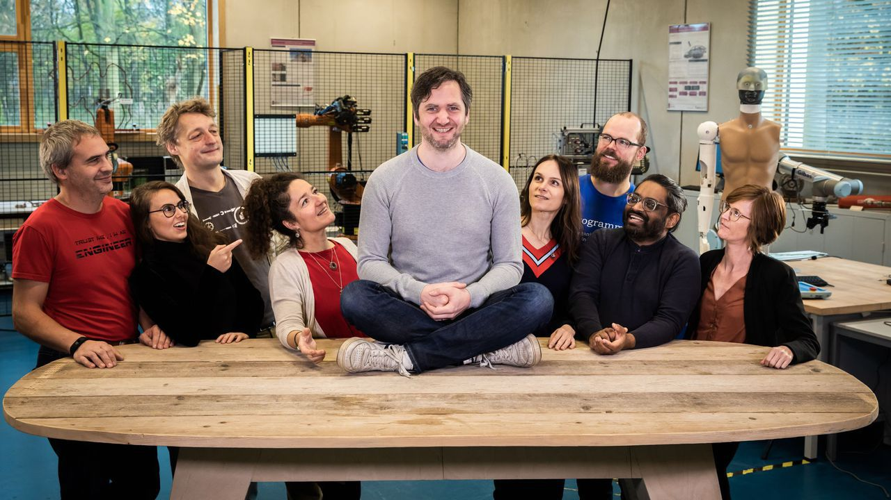

# Team Scheire: Interactief, immersief operatiekwartier

&copy; Canvas 2020

## Projectomschrijving

[Team Scheire](https://www.canvas.be/team-scheire) is een TV-programma geproduceerd door [Canvas](https://www.canvas.be/) waarin een team makers relevante uitdagingen het hoofd probeert te bieden. Dit doen ze door, elk op hun eigen manier, een oplossing te 'hacken'.

Voor het tweede seizoen van Team Scheire werd [imec](https://www.imec.be/nl) gecontacteerd door het Koning Paolo Kinderziekenhuis (ZNA). Initiatiefneemster Debby Callaert en de rest van het pediatrisch team vroegen imec om te helpen bij het __verminderen van pre-operatieve en anesthetische angst bij kinderen.__ 
Kinderen die een operatie moeten ondergaan hebben vaak weinig of geen controle over de situatie, en worden bovendien uit hun vertrouwde omgeving gehaald. Dit kan leiden tot angst en de bijhorende [vecht-of-vluchtreactie](https://nl.wikipedia.org/wiki/Vecht-of-vluchtreactie). Deze kan enerzijds het verdovingsproces belemmeren, en anderzijds tot een langere post-operatieve herstelperiode leiden (o.a. wegens trauma). Het is daarom van groot belang om de angst bij de kinderen zo veel mogelijk te verminderen.

**Afleiding** is een techniek die al bewezen heeft succes te oogsten in een ziekenhuisomgeving. Zo werden eerder al experimenten uitgevoerd met Virtual Reality-toestellen en tablets. In een operatiekwartier zijn de voorwaarden om (nieuwe) technologieën te introduceren echter heel strict, en moet ook rekening worden gehouden met een te respecteren afstand van 1.5 meter tot de patiënt.
Uit het gebruikersonderzoek van Lynn Coorevits bleken de kale operatiekamer en het anesthesiesmasker de meest angstaanjagende elementen te zijn voor de kinderen. Daarom werd voor de oplossing gefocust op het creëren van een immersieve (onderdompelende) omgeving waarin dokters, kinderen en ouders met elkaar en de ruimte kunnen interageren.

Wat we zeker nog willen meegeven: dit is slechts **een mogelijke** oplossing voor het probleem, maar er zijn ongetwijfeld veel andere oplossingen te bedenken!

### De immersieve omgeving

Om de immersieve omgeving te creëren en de kale operatiekamer aan te kleden, werd gebruik gemaakt van projecties. Voor hun operatie krijgen kinderen de keuze uit twee werelden: een onderwaterwereld of de ruimte. In elk van deze werelden worden de kinderen ook gevraagd bepaalde acties uit te voeren die een impact hebben op de omgeving (bv. in het anesthesiemasker blazen opent een schatkist). Het **gewenste gedrag wordt dus aangemoedigd en begeleid vanuit de immersieve wereld**.

### De rekwisieten

Tijdens een traditioneel operatieproces komen kinderen pas in het operatiekwartier in contact met het anesthesiemasker. Bij deze oplossing worden de kinderen echter al **voor de operatie** tot het masker geïntroduceerd. Ze krijgen de kans om zelf een thema te kiezen (onderwaterwereld of de ruimte) en hun masker met thematisch relevante stickers te decoreren. Door de kinderen op voorhand hun rekwisieten te laten kiezen, wordt de (voor hen stresserende) overgang naar het operatiekwartier behapbaarder gemaakt en de angst voor het anesthesiemasker gereduceerd.

Om het immersieve verhaal over heel de lijn door te trekken, werden de stickers ontworpen op basis van de Unity-assets die ook gebruikt werden bij het creëren van de virtuele werelden.

1. [Zelf aan de slag gaan met dit project](docs/git.md)
2. [Gebruikersonderzoek](docs/gebruikersonderzoek.md)
1. [Fysieke opstelling](docs/fysieke_opstelling.md)
2. [Hardware setup](docs/hardware_NL.md)
3. [Software: videoprojectie](docs/software_video_map_NL.md)
4. [Software: videocreatie](docs/software_video_creation_NL.md)
5. [Stickers](docs/stickers.md)
6. [Toekomstige ontwikkelingen?](docs/toekomst.md)

### Kom je problemen tegen of heb je suggesties? 
Maak dan liefst een nieuw ticket aan via github. Dit maakt het eenvoudiger om eventuele problemen en suggesties op te volgen en te documenteren.

Dit kan je doen door op de github repo door te klikken naar [issues](https://github.com/imec-int/team_scheire_OK/issues)
 

Indien je zelf aanpassingen of bijdrages hebt geschreven kun je ook altijd een pull request openen, deze uitleg vind je [hier](docs/git.md#Stap-4:-bijdragen-aan-de-repo).

### Toekomst van het project
We zouden niets liever zien dan dat het project een verder leven leidt, en moedigen daarom iedereen aan om bij te dragen aan dit project. Voorbeelden van domeinen waarop je kan bijdragen:

- Zelfgemaakt beeld- en audiomateriaal dat anderen mogen gebruiken voor nieuwe immersieve werelden. Dit kan ervoor zorgen dat kinderen van verschillende leeftijden en met verschillende voorkeuren aangesproken worden door het verhaal;
- Idee voor een installatie zonder Aruco-markers;
- Reduceren van de kosten, bv. door de installatie draaiende te krijgen op een Raspberry Pi;
- Andere: deel ze gerust!

### Licenties

Dit project werd gebouwd met enkele softwarepaketten en -frameworks. Hieronder vind je een oplijsting van de gebruikte tools en bijhorende licenties waar van toepassing:

1. [Unity license](https://unity3d.com/legal/as_terms)
2. [OpenFrameworks (MIT License)](https://openframeworks.cc/about/license/)
3. Libraries:

	1. [ofxAruco: BSD License](https://github.com/arturoc/ofxAruco)
	2. [ofxCV: MIT license](https://github.com/kylemcdonald/ofxCv)
	3. [ofxHapPlayer: custom license](https://github.com/bangnoise/ofxHapPlayer/blob/master/LICENSE)
	
8. [Raspberry pi documentation: creative commons license](https://www.raspberrypi.org/documentation/)