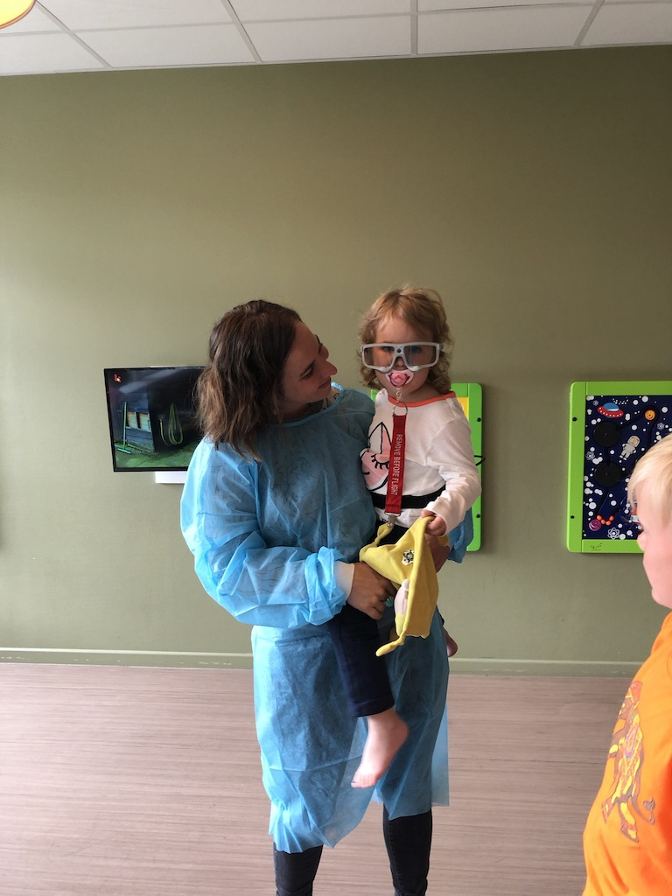

# Eye tracking

Eyetracking is een techniek om te achterhalen waar iemand exact naar kijkt.  
Dit kan via een soort bril waarop in het midden een camera gemonteerd staat, en die de omtrek van de pupil meet.

Eyetracking bij kinderen brengt een aantal extra uitdagingen met zich mee, zoals bijvoorbeeld tijdens de noodzakelijke calibratieprocedure. Kinderen bewegen vaker al eens het hoofd tijdens de calibratie, wat het moeilijker maakt juist te achterhalen waar het kind juist naar kijkt.

## Opzet
Uit deskresearch en interviews bleek dat het type ervaren angst leeftijdsgebonden is. Daarom was het belangrijk een kind uit elke leeftijdscategorie mee te nemen en te achterhalen waar zij telkens naar kijken bij de pre-operatieve voorbereiding: 

* Kind 1 = 0-3 jaar
* Kind 2 = 4-6 jaar
* Kind 3 = 7-10 jaar
* Kind 4 = 11+ 

Beperkingen:
* Omwille van de strikte hygiënemaatregelen in het operatiekwartier was de setup voor de eyetracking fictief. De kinderen deden alsof ze een operatie zouden ondergaan. 
* Er werd slechts 1 punt gecalibreerd aangezien het voor jongere kinderen heel moeilijk is om hun hoofd stil te houden wanneer ze naar verschillende punten moeten kijken. 
* De eyetrackingbril is disproportioneel groot in verhouding tot de grootte van een kinderhoofd. 

Alhoewel eyetracking in principe dus niet optimaal is voor gebruik met kinderen, kozen we er hier toch voor de techniek te gebruiken. De camera op het midden van bril laat immers toe te observeren hoe een kind naar de omgeving kijkt (bv. duurtijd van het kijken, snelheid van beeldwissel, ...) en te identificeren welke oppervlakken de aandacht trekken. Bovendien is een eyetrackingbril comfortabeler voor het kind dan alternatieven als een GoPro-camera.

## Conclusies

Kinderen kijken voornamelijk naar de grote witte opervlaktes in het operatiekwartier en besteden minder aandacht aan de machines dan initieel gedacht. Deze staan blijkbaar te hoog in het gezichtsveld om echt de aandacht te trekken. Bij het neerliggen op de operatietafel neemt de lamp boven de tafel het volledige gezichtsveld in beslag, en ook het anesthesiemasker is erg prominent aanwezig. 

Op basis van de eyetracking werd bepaald dat de aandacht vooral afgeleid moest worden van bepaalde oppervlakken (de vloer, wand en het plafond). De oplossing met projectie diende zich dus vooral te focussen op het immersief maken van deze oppervlaktes.  [zie ook de fysieke inrichting van de ruimte](fysieke_opstelling.md)

