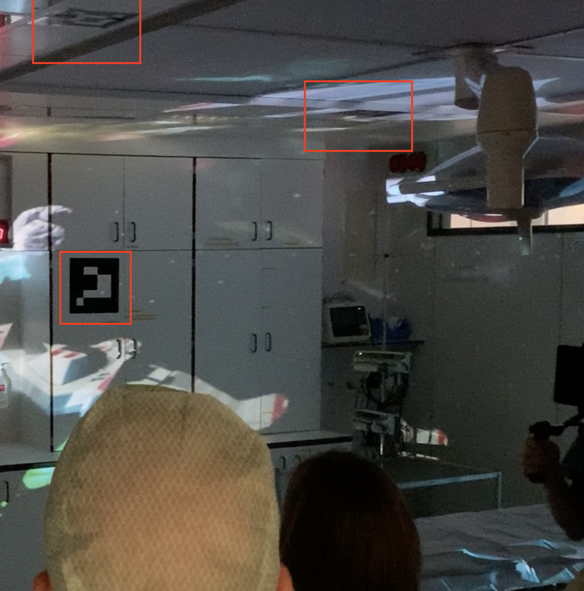
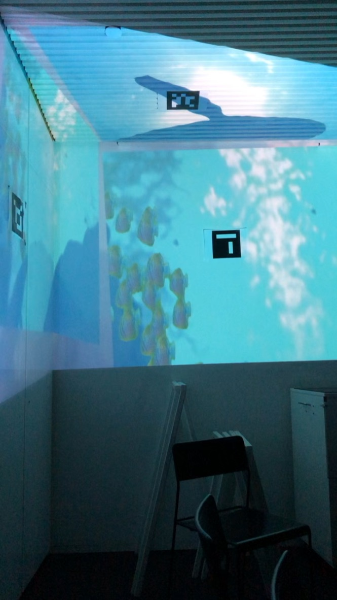

# fysieke opstelling

Voor het Team Scheire project:

- Een operatie kamer met daarin:
	- Een projectorsetup (zie [hardware setup](hardware_NL.md))

	- Markers voor projection mapping op beide muren en het plafond. Waar er geen markers werden gebruikt, gebruikten we presets in de videoprojectie. Dit vereist echter meer manueel werk.

	
## kale muren als projectievlakken
		

