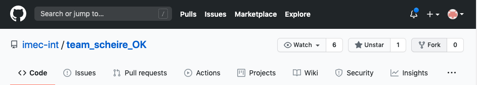
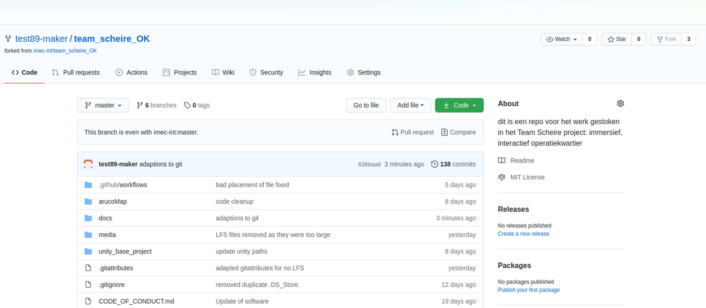
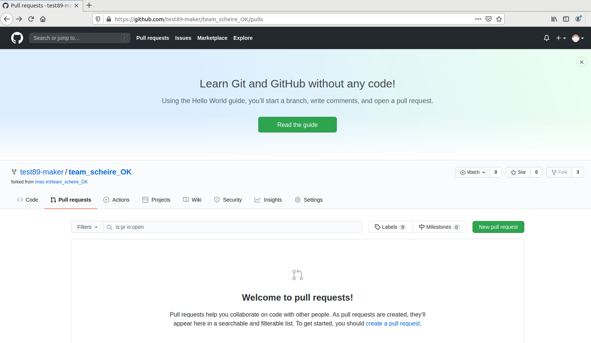
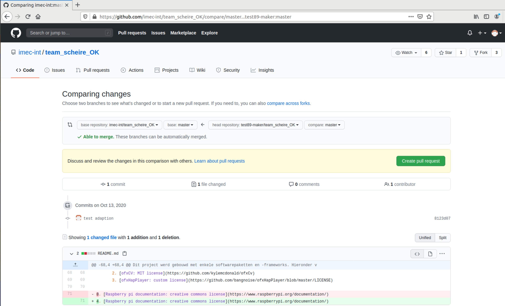
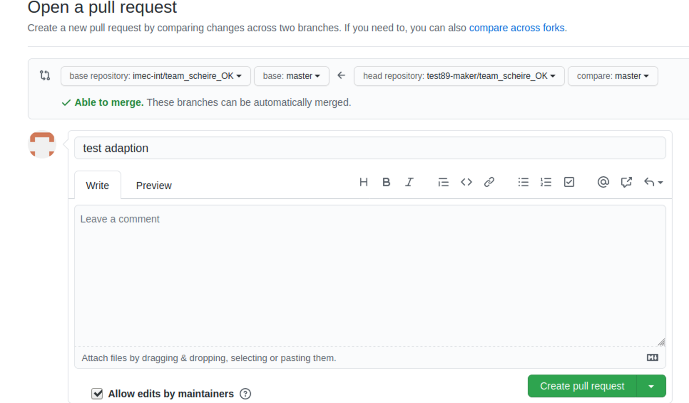

# Zelf aan de slag gaan

Om dit project op je eigen computer te kunnen uitvoeren dien je eerst de hele online mapstructuur ("de repository") te downloaden naar je eigen lokale computer. Dit kun je doen door ofwel een zipfile te downloaden, of door te werken via [git](https://git-scm.com/).

[git](https://git-scm.com/) is een versiebeheersysteem dat ervoor zorgt dat je code kan downloaden én kan zien welke aanpassingen er allemaal gebeurd zijn in het verleden. Ook als je zélf toevoegingen wil doen kan dit via Git (denk bijvoorbeeld aan zelf code aanpassen, zelf nieuw beeldmateriaal toevoegen, ...)

Voor dit project wordt gebruik gemaakt van zowel Git -voor alles code gerelateerd- als Azure Blob storage om de media files te downloaden (audio en video bestanden).

## Stap 1: git account en installeren

Git wordt zeer vaak gebruikt, niet enkel voor dit project dus. De eerste stap is dan ook zeer algemeen en je account en git software kun je dan nog gebruiken voor vele andere applicaties.

Allereerst dien je een **account** te hebben. Deze kan je aanmaken op: [https://github.com/](https://github.com/)

Enkele intuïtieve grafische git programma's vind je op: [GUI clients](https://git-scm.com/downloads/guis/)

Voor Windows en Mac OS X kunnen we [Sourcetree](https://www.sourcetreeapp.com/) aanraden.

Voor Sourcetree zijn de opeenvolgende stappen:

1. [Sourcetree installeren](https://confluence.atlassian.com/get-started-with-sourcetree/install-sourcetree-847359094.html)
2. [Je account connecteren met de applicatie](https://confluence.atlassian.com/get-started-with-sourcetree/connect-your-bitbucket-or-github-account-847359096.html)

## Stap 2: deze repository clonen via sourcetree

Om een lokale variant van de repository te hebben, kan je in Sourcetree volgende stappen ondernemen:

1. Open de Sourcetree-applicatie
2. Klik bovenaan de applicatie op "New..." en "Clone from URL" 

3. Vul volgende info aan in het dialoogvenster:
	1. Link naar de website:`https://github.com/imec-int/team_scheire_OK`
	2. Locatie naar waar je de folder wil kopiëren

4. Klik op "Clone"
5. De folder wordt nu lokaal gekopiëerd. Wijzigingen die je hier aanbrengt worden *enkel* lokaal opgeslagen!

## Stap 3: Downloaden van media files

In de folder `team_scheire_OK/media` dienen audio- en video bestanden geplaatst te worden. Deze kun je downloaden via [volgende link](https://teamscheire2020.blob.core.windows.net/operatiekwartier/files.zip). Download de files, pak ze uit en plaats ze in deze folder zo dat de folderstructuur eruit ziet als:
`team_scheire_OK/media/`

* `audio_material/`
* `video_material/`
* `file_format_NL.md`

## Stap 4: bijdragen aan de repo
Wil je toevoegingen of wijzigingen delen met andere gebruikers in de online repository? Fork dan de repository en vraag dan een "Pull request" aan in Sourcetree. Je dient dan een aanvraag tot verandering in die goedgekeurd kan worden door iemand anders. [Een Nederlandstalige tutorial kan je hier vinden.](https://git-scm.com/book/nl/v2/GitHub-Aan-een-project-bijdragen) Let op, het lijkt misschien overweldigend, maar valt best mee!

Een kort overzicht:

1. Fork de originele repository door rechtsboven op "fork" te klikken:

2. Je hebt nu de repository onder je eigen account staan. Als je wijzigingen aanbrengt, dan staan die online in jouw versie van de repository.
3. [clone](#Stap-2:-deze-repository-clonen-via-sourcetree) nu deze fork via sourcetree.
4. Nu kun je lokaal aanpassingen maken
5. Eens je tevreden bent van een stap (bijvoorbeeld een stuk code geschreven) wil je dit online zetten. Dit doe je door een boodschap ("commit") te schrijven over wat je veranderd hebt en deze online te "pushen": [tutorial](https://confluence.atlassian.com/sourcetreekb/commit-push-and-pull-a-repository-on-sourcetree-785616067.html)
6. Online kun je nu je aanpassingen zien: 
7. Dan klik je door naar "Pull requests": 
8. Kies voor "New pull request"
9. Dan krijg je een overzicht te zien van wat je wilt aanpassen: je wilt de aanpassingen van je eigen variant (fork) overbrengen naar de originele repository. 
10. Klik nu op Create pull request
11. Schrijf er en boodschap bij: 
12. Proficiat, voor jou zit het er nu op! Nu kunnen de mensen die de repository onderhouden je aanpassingen toevoegen en je pull request afsluiten.