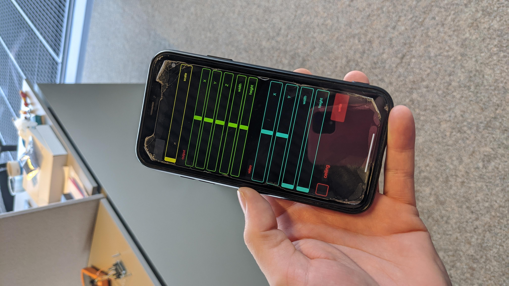
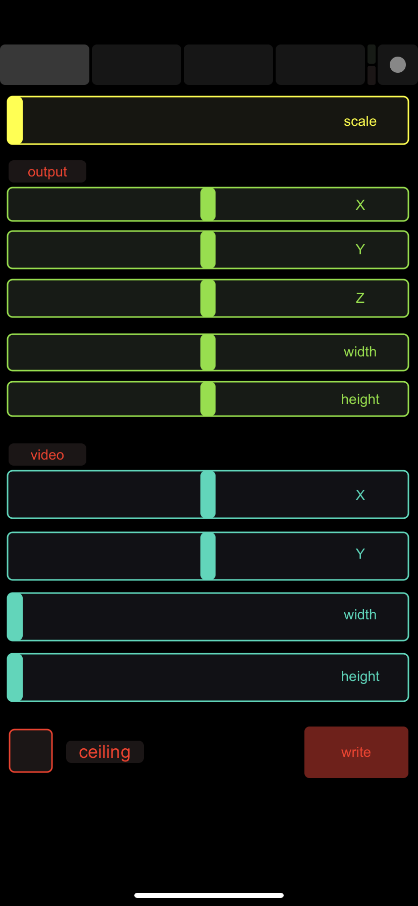
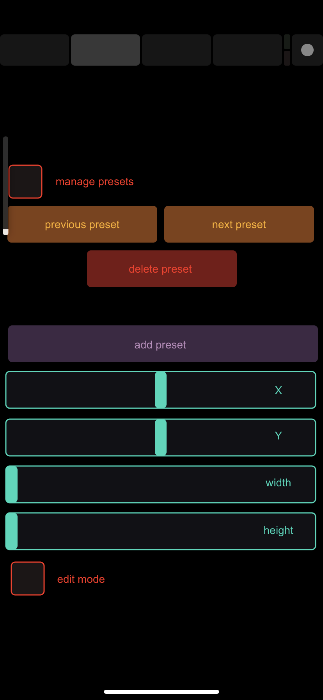
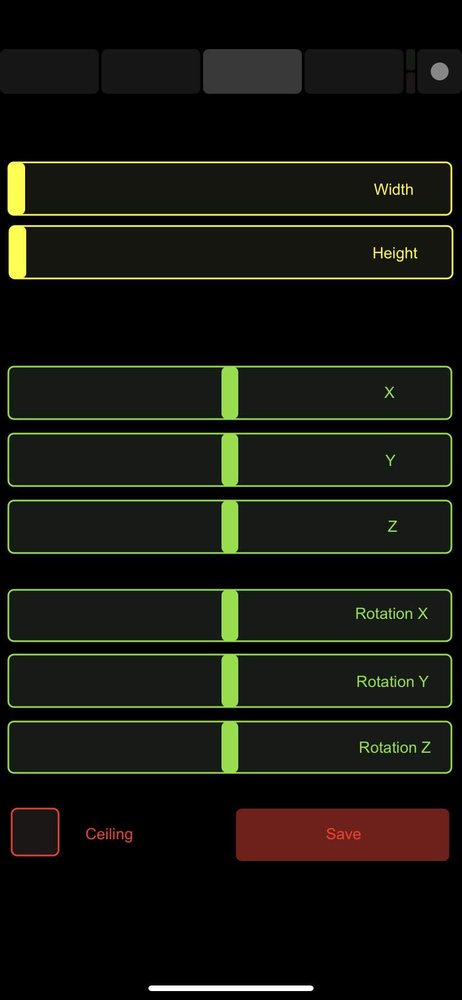

# Software voor video mapping
## Waarom?

Uit het gebruikersonderzoek is gebleken dat kinderen vooral naar de _kasten en lege muren_ kijken bij het binnenkomen van het operatiekwartier. Wannneer ze gaan liggen op het bed wordt hun zicht beperkt tot enkel het _plafond_. Daarom werd beslist om projectiemateriaal te ontwikkelen voor zowel de muren als het plafond. 

De meest voor de hand liggende oplossing was om meerdere projectors in te zetten, in functie van het gekozen oppervlak. Het nadeel hierbij is dat elke projector gefixeerd zou moeten worden om de mapping juist te krijgen. Bovendien vereist deze oplossing redelijk wat hardware per operatiezaal. _(Opm: elk operatiekwartier beschikt over meerdere zalen die in rotatie gebruikt worden. Zo kan elke zaal na gebruik gedesinfecteerd worden, terwijl de andere in gebruik wordt genomen)._ Dokters en verpleegkundig personeel hebben echter niet de tijd om iedere keer een volledige setup te doen van de mappings, of om de projectors juist te richten. 

We kozen dus voor een andere oplossing. Daarbij werden grote Aruco-markers (geprint op stickerpapier via een plotter) tegen de kasten gehangen, wat toeliet om automatisch te detecteren waar de projector zich naar moest richten. Deze stickers voorzagen de oplossing van de juiste info rond het type oppervlak en de nodige mapping en oriëntatie. Bovendien konden we de oplossing selectief programmeren, zodat bijvoorbeeld werkruimten met rust konden worden gelaten en het medisch personaal ongestoord zijn werk kon doen.

## software setup

Het originele beeldmateriaal werd geproduceerd in Unity (zie [video creatie](./software_video_creation_NL)). Je kan echter ook zelf beeldmateriaal produceren en toevoegen aan de applicatie.

Dit kan je op volgende manier doen:

1. Produceer drie videolagen voor zowel het plafond als de muur (m.a.w., in bovenaanzicht en zijaanzicht). Dit brengt het totaal op zes bestanden per thema:
    1. Een achtergrond voor plafond en muur
    1. Een voorgrond (inclusief transparantie) voor plafond en muur
    1. Een interactielaag (inclusief transparantie) voor plafond en muur
1. Doe dit voor elk van de gekozen thema's (in dit geval: onderwater en ruimtereis)
1. Maak in de `bin/data`-folder van je openframeworksinstallatie een map aan, en vernoem deze naar je thema (bv. `/space` of `/water`)
1. Kopieer de videofiles naar de overeenkomstige mappen
    1. Ofwel de bestaande werelden uit `media/video_material` op onze git
    2. Ofwel de zelfgemaakte werelden (indien je het voorbeeld Unity-project neemt: vanuit de map `recordings`)
    3. Controleer daarna de naamgeving via [videosettings en oppervlakken](#video-settings-en-oppervlakken)
2. In `bin/data/sounds` kan je ook een ander achtergrondmuziekje (.mp3) plaatsen dat beter bij jouw beeldmateriaal past. Gebruik hierbij de naamgeving `background.mp3` of pas dit aan in `ofApp.cpp`)
1. Build en run de applicatie

### Prerequisites 

* Een reeds geïnstalleerde versie van [Openframeworks](https://openframeworks.cc/download/), beschikbaar voor zowel OSX, Windows als Linux.
* TouchOSC, geïnstalleerd op GSM
* [TouchOSC Bridge](https://hexler.net/products/touchosc)
* [TouchOSC editor](https://hexler.net/products/touchosc)

Windows: gebruik [VSCode](https://openframeworks.cc/setup/vs/)
Mac: Gebruik [XCode](https://openframeworks.cc/setup/xcode/)
Linux: Gebruik [whatever](https://openframeworks.cc/setup/linux-install/)

### Openframeworks

OpenFrameworks is een opensource, C++-based framework, supercharged met add-ons. 

Openframeworks werd ontwikkeld door Zach Lieberman als een toolbox voor _creative coding_ (o.a. dus voor interactieve videoinstallaties zoals in dit project). Het werd sindsdien omarmd door de opensource crowd en kent nog steeds uitbreidingen en updates. We kozen voor OpenFrameworks omdat de detectie van Aruco-markers het snelst implementeerbaar was via bestaande OpenFrameworks add-ons, wat van belang was gezien de strakke deadline van het project. Bovendien waren de add-ons voor OSC en interface design ook van waarde.

Om het project te kunnen builden hadden we nood aan onderstaande plugins. Sommigen zijn reeds beschikbaar in OpenFrameworks, anderen moeten nog toegevoegd worden. Je kan dit doen door ze manueel te downloaden en toe te voegen aan de 'addons'-folder in openframeworks.

* [ofxAruco](https://github.com/arturoc/ofxAruco)
* [ofxCv](https://github.com/kylemcdonald/ofxCv)
* ofxGui - (included)
* [ofxHapPlayer](https://github.com/bangnoise/ofxHapPlayer)
* ofxOpenCv - (included)
* ofxOsc - (included)
* ofxPoco - (included)
* ofxXmlSettings - (included)

#### Installeren OpenFrameWorks

Volg de Engelstalige installatiegidsen op [OpenFrameworks](https://openframeworks.cc/download/)

#### From git to build

Het builden van het project verschilt van OS tot OS. We lijsten hieronder kort even wat aandachtspunten op: 

_Opm: initiëel gingen we van start met development op macOS, maar we stapten over op Windows wanneer bleek dat de RPI3 niet performant genoeg was, en dat de RPI4 nog geen ondersteuning bood voor OpenFrameworks. Wegens tijdsgebrek was het ook niet mogelijk dit extenstief te testen of de applicatie verder te optimaliseren. We kochten een NUC aan en zorgden dat de applicatie hierop kon draaien, onder andere door de toevoeging van de hap video player._

##### Mac

!!! ofxHapPlayer is niet beschikbaar voor mac. Je kan deze vervangen door ofVideoPlayer, maar dan moeten bepaalde lijnen (getError) verwijderd worden. Vergeet ook niet deze uit de addons.make file te halen.

* Download en extract de repository via zipfile of download via git 
* Kopieer `arucoMap` naar  `openframeworks/apps/myApps`
* Gebruik de [ProjectGenerator](https://openframeworks.cc/learning/01_basics/create_a_new_project/) om het project aan te maken
    * Open de ProjectGenerator
    * Klik 'import' en navigeer naar de projectfolder
    * Druk op 'generate' om de projectfiles aan te maken. Dit maakt meteen ook de xcode projectfiles aan
* Open het project in xcode
* Gebruik de build-functionaliteiten om de applicatie te builden en te runnen

Je kan dit ook builden en runnen met `make` en `make run`. Neem daarvoor volgende stappen:

* Dupliceer de `emptyproject`-folder en geef deze een nieuwe naam
* Kopieer de `/src` en `/bin` folder naar de nieuw aangemaakte folder
* Vervang de `addons.make`-file door deze uit het gedownloade project
* Navigeer via een terminal naar deze folder en run de commands `make` en `make run`

De projectfiles komen in de '/src'-folder, de datafiles (video en XML) en de uiteindelijke builds komen in de '/bin'-folder.

##### windows

* Download en extract de repository via zipfile of download via git 
* Kopieer `arucoMap` naar `openframeworks/apps/myApps`
* Kopieer de `emptyproject`-folder
* Kopieer de `/src` en `/bin` folder naar de nieuw aangemaakte folder
* Open het project in VSCode
* Gebruik de build-functionaliteiten om de applicatie te builden en te runnen

##### Linux
* Download en extract de repository via zipfile of download via git 
* Kopieer `arucoMap` naar `openframeworks/apps/myApps`
* Kopieer de `emptyproject`-folder
* Kopieer de `/src` en `/bin` folder naar de nieuw aangemaakte folder
* Vervang de `addons.make`-file door deze uit het gedownloade project
* Navigeer via een terminal naar deze folder en run de commands `make` en `make run`

Na het builden van het project kan je de applicatie opstarten. Dit geeft initieel een zwart scherm omdat de applicatie in _live_-modus draait en nog geen markers kan detecteren. Markers worden namelijk enkel gedetecteerd wanneer de _tracking_-modus aan staat. Dit kan je doen door de knop "T" of "6" langdurig in te drukken. Indien er slechts 1 marker gedetecteerd wordt, kan je het te projecteren vlak voor deze marker instellen via OSC (zie onder). Dit moet natuurlijk gebeuren om de eerste projectievlakken aan te maken. 

## OpenFrameworks libraries

### Remote control

#### OSC

Om de projectie-opstelling aan te kunnen sturen, kan er in twee modi gewerkt worden: de 'live'-modus (met markers) en de 'preset'-modus (zonder markers). 

Je kan dit aanpassen via de remote numpad (waarbij 0 = live, 1 tot 3 = presets). 

##### Preset modus
De presets tonen een vooringestelde configuratie van projectievlakken. Om deze vlakken in te stellen maken we gebruik van *OSC*. OSC is een communicatiemethode die te vergelijken valt met MIDI. OSC kan met andere OSC-enabled toestellen communiceren via channels.

Om de vlakken in te stellen, maakten we gebruik van [TouchOSC](https://hexler.net/products/touchosc). De file die hiervoor nodig is bevindt zich in de 'additions'-folder.

TouchOSC is een (betalende) app waarmee je messages en slider-waarden (zie foto voor interface) kan doorsturen naar de applicatie via het IP-adres van de computer (op voorwaarde dat je met eenzelfde netwerk geconnecteerd bent).

##### Live modus

De live-modus staat toe dat de webcam markers detecteert. Op basis hiervan wordt automatisch bepaald welke vlakken er geprojecteerd moeten worden.

Indien de applicatie is ingesteld op _live_ en er slechts één marker zichtbaar is, kan je de view hiervan instellen via TouchOSC. Vergeet niet het juiste IP-adres in te stellen in `settings.hpp`.

##### Live 

| Name | Function |
| ------------- |:-------------:|
| Scale | Schaal van het projectievlak |
| **Output** | **Projectievlak instellingen** |
| X | Horizontale positie | 
| Y | Verticale positie  |
| Z | Diepte positie |
| Width | Breedte van het vlak |
| Height | Hoogte van het vlak |
| **Video** | **Video input instellingen** |
| X | Horizontale positie | 
| Y | Verticale positie  |
| Width | Breedte van de crop |
| Height | Hoogte van de crop |
| Ceiling | Gebruik de ceiling video ipv de wall video | 
| Write | Instellingen oplaan |

##### Presets

❗️❗️❗️ 'Edit mode' moet ingeschakeld zijn om wijzigingen te kunnen aanbrengen (zie ook tweede scherm onderaan) ❗️❗️❗️

| Screen 1 | Screen 2 | Screen 3 |
| :-------------: |:-------------:| :-------------:|
|  |  |  |

| Name | Function |
| ------------- |:-------------:|
| Previous preset | Vorige preset |
| Next preset | Volgende preset |
| Delete preset | Verwijder huidige preset |
| **Video** | **Video input instellingen** |
| X | Horizontale positie | 
| Y | Verticale positie  |
| Width | Breedte van de crop |
| Height | Hoogte van de crop |
| **Positionering** | **Positie instellingen** |
| Width | Breedte van de preset |
| Height | Hoogte van de preset |
| X | Horizontale positie | 
| Y | Verticale positie  |
| Z | Diepte positie  |
| RX | Horizontale rotatie | 
| RY | Verticale rotatie  |
| RZ | Diepte rotatie  |

### Projection mapping - Markers

#### Aruco

Aruco-markers worden gebruikt om de applicatie te vertellen op welk oppervlak (muren, plafond, ...)  deze moet projecteren. De markers die wij gebruikten waren minstens A3, om er zeker van te zijn dat de webcam deze accurraat kon detecteren. Hoe groter de markers, hoe beter de resultaten. Eens de applicatie wordt opgestart en de gebruiker de tracking activeert, worden de markers gezocht door de `ArucoHandler.cpp`-class. Dit is het moment waarop het belangrijk is de projector en de webcam juist te aligneren. 

Elke Aruco-marker kent een uniek ID die gebruikt kan worden om een bepaald deel van een video te projecteren, met een bepaalde transformatie (width, height, x- / y-offset). 

#### Markers 

De markers zijn belangrijk voor de Aruco-library. Wanneer de library de markers detecteert, kan deze afleiden welke marker het is en in welke oriëntatie die zich bevindt. Door deze oriëntatie dan toe te passen op de beelden komt een automatische mapping tot stand. 

Het is hierbij belangrijk dat de markers voldoende groot zijn (in ons geval minstens A3), en op niet-reflecterend papier afgeprint worden (don't repeat our mistakes). 

Markers kunnen gegenereerd worden met bijvoorbeeld [deze online tool](https://chev.me/arucogen/). We raden sterk aan de ID van de gegenereerde marker reeds toe te voegen aan de `bin/data/presets.xml` file.

## Videosettings en oppervlakken

De videoinput kent drie videolagen voor de muren, en drie voor het plafond - allen geëncodeerd in [HAP](https://hap.video/) om transparantie te ondersteunen.

De eerste laag is de achtergrond, waar de andere lagen overheen worden gelegd:

* [water or space]/[wall or ceiling]_background.mov
* [water or space]/[wall or ceiling]_foreground.mov
* [water or space]/[wall or ceiling]_interaction.mov

Uiteraard kan men de code wijzigen zodat slechts 1 videofile wordt gebruikt, maar dit schakelt ook de interactieve component uit.

Eerst wordt een [FBO](https://openframeworks.cc/documentation/gl/ofFbo/) opgebouwd in de update-functie. Daar worden de drie videolagen over elkaar heen gelegd en een FBO-shader gegenereerd. Vervolgens kan deze in de draw-functie getekend worden met de transformatie gedetecteerd door de Aruco class.
Dit kan omdat de transformatie, herkend door de Aruco class, aangevuld wordt met informatie die wordt ingegeven door de OSC class. 

Het ZNA Kinderziekenhuis Koningin Paolo had reeds een mascotte, _Groene Louis_, die we integreerden in de eigen visualisaties. Groene Louis kan in beeld springen vanuit één zijde van de projectie door gebruik te maken van de shortcut "4" of "L". Dit gebeurt manueel, zodat het medisch personeel Groene Louis konden oproepen wanneer ze dit zelf zinvol vonden.

## Videoprojectie - Presets

De presets kunnen gebruikt worden op locaties waar de markers niet opgehangen kunnen worden of niet aanwezig zijn. We denken daarbij bijvoorbeeld aan het dokterskwartier. De presets geven een vooringestelde opstelling weer van de vlakken. Het eerste kan gebruikt worden op de kruising van twee muren en het plafond; het tweede vertegenwoordigt een vast projectievlak (recht tegenover de projector).

Om deze presets in te stellen, zie OSC.

## Shortcuts

We gebruikten een draadloze numpad om binnen een steriele omgeving de applicatie te kunnen gebruiken. 

| Function | Key |
| ------------- |:-------------:|
| Track markers | 6 / T |
| Display live | 0 | 
| Display Preset 1 | 1 |
| Display Preset 2 | 2 |
| Display Preset 3 | 3 |
| Display overlay interaction | 4 / L |
| Display in-video interaction | 5 / I |
| Debug mode* | 7 / V |
| Show webcam image | 8 / C |
| Mute sound | 9 |
| Load space scene | - / S |
| Load water scene | + / W |
| Play sound | . |

* Debug mode: Weergave van de indicatie rond gevonden Aruco-markers

## Known issues

Er zijn een paar problemen waar we weet van hebben, maar waar we onvoldoende tijd voor hadden om ze op te lossen:

### Mapping Z-offset

1. De locatie van de projecties op basis van de markers kent een probleem waarbij de Z-offset slecht ingesteld staat. Dit heeft invloed op de multiplier van de grootte van de projecties. 
2. Het netwerken via OSC had anders gekund, bijvoorbeeld via een lokaal netwerk of een kleine included router.
