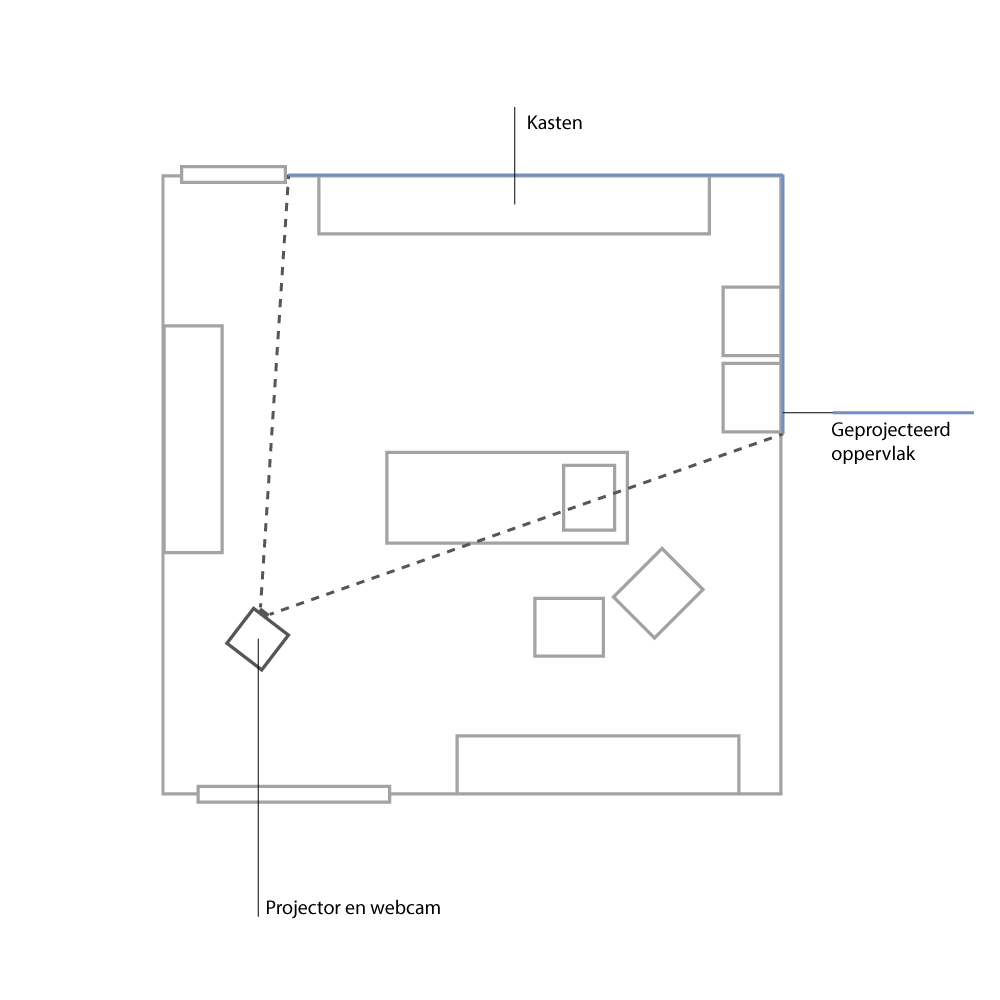

# fysieke opstelling

Voor het team scheire project:

- een operatie kamer met daarin:
	- een projectorsetup (zie [hardware setup](hardware_NL.md))
	- markers op beide muren en op het plafond.

		
Waarom is dit zo?

Waarom deze elementen op deze locatie?
 	 

## PICS OR DIDN'T HAPPEN 