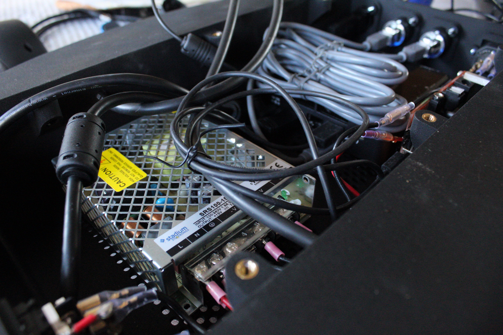
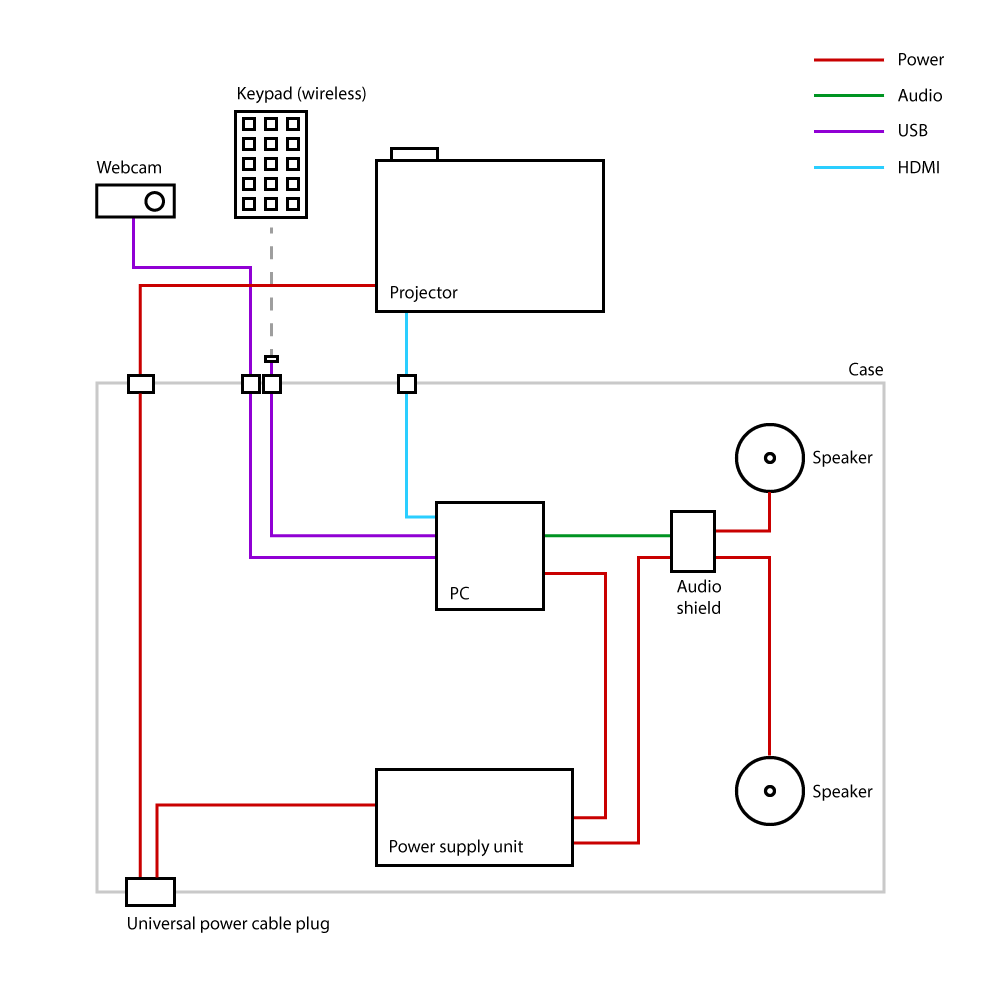

# hardware setup

## Componenten
* Projector:  H11ST optoma
* Computer: Intel NUC
  * Intel core i5
  * 8GB DDR4
  * 240GB SSD
* Audio shield: [Any](https://www.adafruit.com/product/1752) stereo amplifier
* Webcam: Logitech C270
* Power supply: Stadium SRS100 
  * Deze geeft stroom aan zowel de NUC as aan de audio shield (en speakers)
* Remote: om het even welk draadloos numpad
  * De applicatie gebruikt numerieke input om modi te selecteren

### Assembly

⚠️⚠️⚠️ Werken met power supply units wil zeggen werken met hoge ontblootte stroom, wees voorzichtig en werk onder toezicht ⚠️⚠️⚠️

Om ervoor te zorgen dat we de encasing niet al te vaak open hoefden te vijzen, besloten we te werken met throughplug adaptors, invijsbaare 

### Projector

We besloten voor deze optoma te gaan om een brede projectiehoek te verkrijgen voor een aanvaardbare prijs. de Optoma kon dit bereiken. Deze ondersteund ook seriele input voor latere uitbreidingen.
De brede projectiehoek zorgt ervoor dat we op een groot oppervlakte kunnen projecteren vanop een korte afstand. 
Dit is natuurlijk geen verplichting, indien de ruimte groot genoeg is kan dit werken met een standarad projector. vergeet echter niet: de webcam behoort hetzelfde perspectief te hebben als de projector om accuraat te kunnen calculeren waar te projecteren, en hoe verder deze moet kijken, hoe groter de markers behoren te zijn.

De hoeveelheid [(ansi)-lumen](https://nl.wikipedia.org/wiki/Lumen_(eenheid)#:~:text=De%20lumen%20(symbool%3A%20lm),lichtbron%20in%20alle%20richtingen%20uitstraalt.) is ook van belang: afhankelijk van hoeveel licht er in de ruimte valt (zeker zonlicht) dient men voor hogere lichtopbrengst te gaan. 

### Raspberry PI

In eerste instantie wouden we de oplossing draaiende krijgen op een Raspberry Pi. Na verschillende video problemen op de RPI3, besloten we gebruik te maken van een RPI4 om deze problemen op te lossen. Openframeworks bleek ten tijde van opname nog niet te werken op de RPI4. We verlieten deze piste en besloten verder te gaan met de Intel NUC (beschreven in [Componenten](## Componenten)).

Ten tijde van schrijven (september 2020) deden we nieuwe tests met de RPI4. Openframeworks is compileerbaar, en de oplossing lijkt te builden. Er blijken echter nog problemen te zijn met het loopen van de video, het gebruik van transparante video en het algemeen gebruik van de computing power: het was niet zeker of we een aanvaardbare framerate gingen krijgen. 

Om dit werkende te krijgen zou het nodig zijn de rendering op te delen in verschillende threads, de transparante video te vervangen door een lichter alternatief (GIF, ...). Momenteel is dit niet uitgevoerd maar zou een logische, nuttige next-step zijn.

## Encasing

We besloten het geheel in een 3d-geprinte case te omvatten. In ons geval was dit een must om de steriele omgeving van het hospitaal te garanderen, maar is voor thuisgebruik volledig optioneel, doch handig om alles bijeen te houden. We besloten de case die wij gebruikten tevens te laten dienen als klankkast voor de speakers. 

Het totaalpakket werd gemonteerd op een [mixer stand](https://www.bax-shop.be/nl/19-inch-racks/quiklok-ql-400-desktopstand?gclid=EAIaIQobChMIs6SFkMzG5QIViIxRCh3yJQK5EAQYGCABEgIFMPD_BwE). Omdat deze de projector naar boven en naar beneden kon richten, konden we vlot wisselen tussen een projectie op de muren of op het plafond. Deze liet ook enige flexibiliteit toe. Alle bekabeling bevind zich in de case. Voor stroom werd een universal power cable plug aangebracht onderaan de case. Deze had naast een schakelaar (die tegelijk de projector, NUC en speakers uit kon zetten) ook een zekering. 

