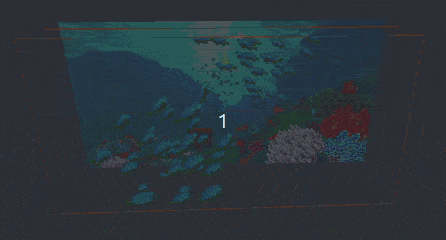
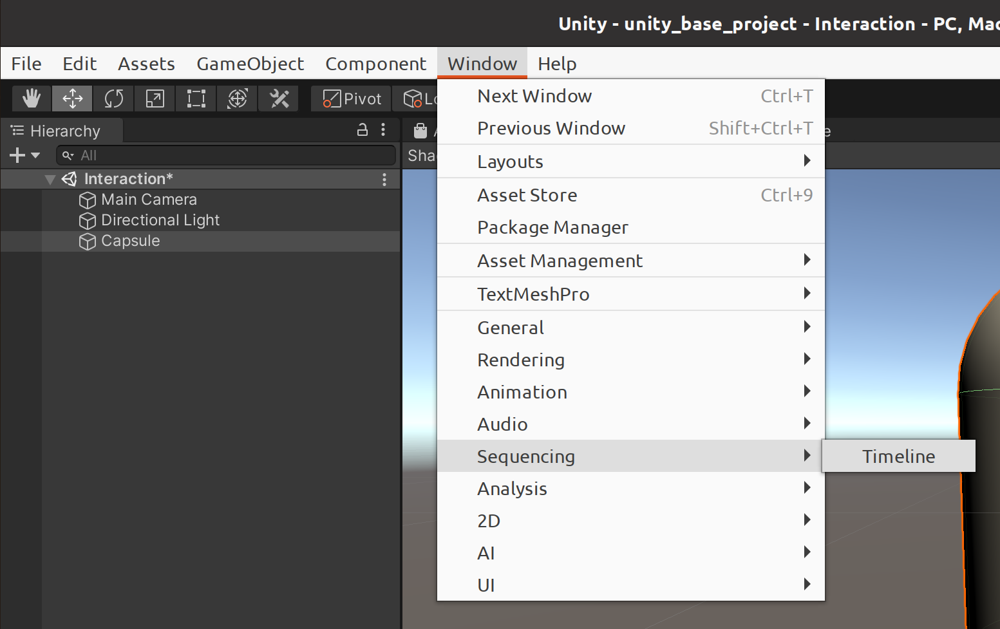
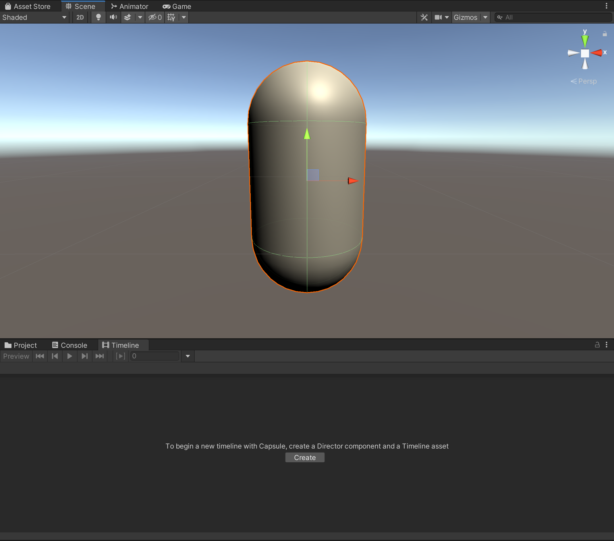
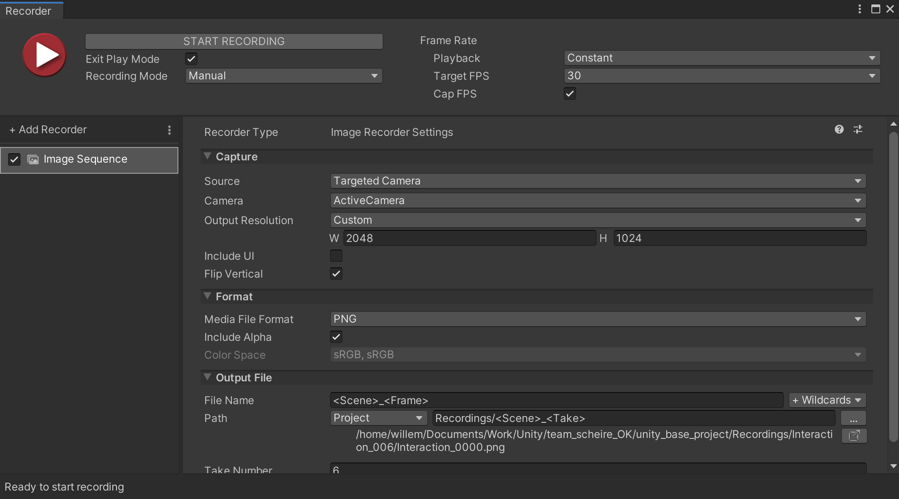
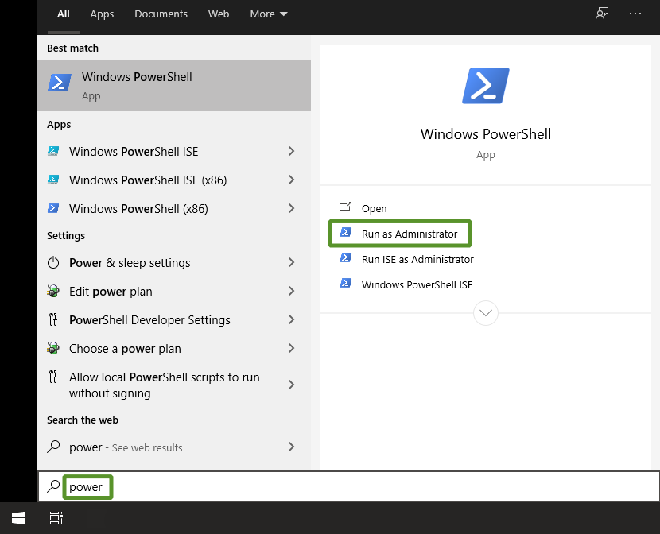

# Video creatie

- [Video creatie](#video-creatie)
	- [Technische vereisten](#technische-vereisten)
		- [Video afmetingen](#video-afmetingen)
		- [Bestandsformaat](#bestandsformaat)
	- [Compositing](#compositing)
		- [Achtergrond](#achtergrond)
		- [Interactie](#interactie)
		- [Voorgrond](#voorgrond)
	- [Beeldmateriaal maken met Unity](#beeldmateriaal-maken-met-unity)
		- [Unity installeren](#unity-installeren)
		- [Project openen](#project-openen)
		- [Opbouw van het project](#opbouw-van-het-project)
		- [Een simpele animatie maken](#een-simpele-animatie-maken)
			- [Voorbereiding](#voorbereiding)
			- [Animatie opzetten](#animatie-opzetten)
			- [Animeren](#animeren)
		- [De animatie uitrenderen](#de-animatie-uitrenderen)
		- [Waar kan ik extra modellen vinden?](#waar-kan-ik-extra-modellen-vinden)
	- [Converteren naar hap formaat](#converteren-naar-hap-formaat)
		- [Installatie ffmpeg](#installatie-ffmpeg)
			- [Windows](#windows)
			- [Mac/Linux](#maclinux)
		- [Een bestaande video omzetten](#een-bestaande-video-omzetten)
		- [Een afbeeldingen sequentie omzetten](#een-afbeeldingen-sequentie-omzetten)

Om een mooie interatieve projectie te maken hebben we meerdere video files nodig. Je kan deze video files maken met veel verschillende open en gesloten software of met bestaand beeldmateriaal. Je kan bijvoorbeeld aan de slag gaan met 3D animatie software zoals [Blender](https://www.blender.org/) of misschien werk je liever met 2D animatie software? Voor Team Scheire zijn we gegaan voor een game engine als animatie software: [Unity](https://unity.com/).

Voorbeelden van andere software die je kan gebruiken:
- Open Source
  - [Blender](https://www.blender.org/) (3D software)
  - [Synfig](https://www.synfig.org) (2D software)
  - [Godot](https://godotengine.org/) (Game engine)
  - [Kdenlive](https://kdenlive.org/en/) (video software)

- Closed Source
  - Adobe After Effects (2D software)
  - Unity (Game engine)
  - Adobe Premiere Pro (video software)

Welke software je gebruikt maakt niet uit, maar verifieer of de software de onderstaande technische vereisten kan ondersteunen.

## Technische vereisten

Voor elk thema hebben we 6 video bestanden nodig:

1. plafond/achtergrond.mov
2. plafond/interactie.mov
3. plafond/voorgrond.mov
4. muren/achtergrond.mov
5. muren/interactie.mov
6. muren/voorgrond.mov

### Video afmetingen

- De voorgrond en interactie videos bevatten een transparantie/alpha kanaal
  - Het transparantie kanaal is nodig om meerdere videos op elkaar leggen, meer hierover later in [Compositing](#compositing)
- De video moet loopen 
  - Eerste en laatste frame zijn hetzelfde, opdat een gebruiker niet merkt dat er een einde is aan de video
- De video is 2048x1024 pixels
  - Lagere of hogere resoluties zijn mogelijk maar dit bleek een goede balans tussen beeldkwaliteit en hoe zwaar de video files waren.
  - ❗Als de video een afwijkend resolutie heeft zorg er dan wel voor dat de [beeldverhouding](https://nl.wikipedia.org/wiki/Beeldverhouding) 2:1 blijft
- Bij voorkeur is de framerate 30 afbeeldingen per seconde(fps)
  - Lagere of hogere framerates zijn mogelijk maar dit was wederom een goede balans tussen beeldkwaliteit en hoe zwaar de video files waren

Je video mag dus afwijken van framerate, resolutie of beeldverhouding maar zorg er wel voor dat alle videos dezelfde framerate, resolutie en beeldverhouding zijn. Mixen van videos met andere afmetingen werkt niet.

### Bestandsformaat

Alle 6 van deze bestanden moeten van het `.mov` formaat zijn en daarbovenop moeten ze in het [hap](https://hap.video/) formaat geëncodeerd worden. Het voordeel van het `hap` formaat is dat het efficiënt kan afgespeeld worden, hierdoor heeft de projectie hardware lagere performantie vereisten. Het formaat kan ook goed om met transparantie in de video files wat we nodig hebben voor de `interactie` en `voorgrond` video files.

Je kan bijna eender welk videoformaat of afbeeldingen sequentie eenvoudig omzetten naar hap zie: [Converteren naar hap formaat](#converteren-naar-hap-formaat).

## Compositing

De drie videos gaan in lagen over elkaar getoond worden door de [projectie software](./software_video_map_NL.md), dit proces van samenvoegen heet compositing.
Let dus op dat je video files rekening houden met de mogelijkheden en beperkingen van compositing.

In de afbeelding zie je goed hoe de drie lagen over elkaar gelegd worden om het uiteindelijk resultaat te bekomen. Let op de (voorgrond) visjes die bovenop de kist (interactie laag) zwemmen.

  

### Achtergrond

De achtergrond video is de basislaag voor de projectie, zorg er dus voor dat deze volledig gevuld is. Elk geanimeerd object dat nooit voor de interactie laag komt kan in deze laag gestoken worden.

### Interactie
De interactie laag is de tussenlaag waar het kind of de arts controle over zal hebben. Deze laag zit bovenop de achtergrond. Zorg er dus voor dat je transparantie gebruikt.

### Voorgrond
De voorgrond laag komt bovenop de interactie laag en geeft meer diepte aan de projectie door nog animatie bovenop de interactie laag mogelijk te maken.

## Beeldmateriaal maken met Unity

Deze tutorial gaat enkel over de basis van Unity heb je interesse om er meer over te leren kan je de officiële cursussen volgen (Engelstalig): [https://learn.unity.com/](https://learn.unity.com/)

### Unity installeren

Om te starten download je de Unity Hub: [https://unity3d.com/get-unity/download](https://unity3d.com/get-unity/download)

Dit is een launcher om verschillende Unity installaties te beheren.

Na installatie van de hub installeer je de laatste LTS release van Unity. Dit zijn stabielere versies met lange ondersteuning in de voorbeelden hieronder is dat 2019.4. 
> ❗Latere versies kunnen mogelijk afwijken van deze handleiding.

### Project openen

Je kan een startproject vinden in de folder `unity_base_project`. Je kan ook je eigen project aanmaken maar dit startproject staat al vooraf ingesteld met de nodige dependencies (specifieke benodigdheden) en configuraties.

Voeg het project eerst toe aan de Unity Hub met de `Add` knop. Open daarna het project door op het project in de lijst te klikken.

### Opbouw van het project

In de folder Scenes vind je 3 Scenes:

 - Background
 - Interaction
 - Foreground 

Elke scene gaan we uitrenderen als een aparte video. Dit maakt het makkelijker om ze te onderscheiden.

Je kan ook kijken naar de scene in `Scenes/Validation/VideoTestScene` deze scene is opgezet om je finale .mov files uit te testen en te valideren binnenin Unity.

### Een simpele animatie maken

Omdat Unity een game engine is, kan je een animatie maken via code maar ook via een timeline zoals andere animatiesoftware. In deze handleiding beperken we ons tot het gebruiken van een timeline, voor meer info over hoe je met code animeert zie: [https://learn.unity.com/](https://learn.unity.com/)

#### Voorbereiding
Vooraleer we beginnen, moeten we ervoor zorgen dat de resolutie correct staat.

1. Open de game window (zie afbeelding)
2. Klik op de resolutie knop: `Free Aspect` 
   
3. Hier kies je voor 2048x1024, als deze preset nog niet bestaat kan je het zelf aanmaken door op het plus icoontje te klikken. 
   

#### Animatie opzetten
1. Plaats je object in de scene door het vanuit je project folder in de scene te slepen
   - Als voorbeeld gaan we werken met een capsule object, dit kan je aanmaken in het menu via `GameObject/3D Object/Capsule`.
   
2. Open de timeline window 
   - Je kan deze timeline overal plaatsen door de titel van de window te slepen naar een andere locatie
3. Zorg ervoor dat je object geselecteerd is, daarna kan je in de timeline window op create klikken om de animatie director aan te maken. 
   
    - Unity gaat vragen waar je deze wil opslaan, dit mag eender waar in het project maar zorg ervoor dat de naam overeenkomt met de naam van je scene om het overzichtelijk te houden.
4. Open het menu van je nieuwe animatie director door het aan te klikken in de Project window. Zorg ervoor dat de Frame rate op 30 staat ipv van 60. 
   

#### Animeren
1. Start de opnamesessie door op de rode knop te drukken in de timeline 
   - De balk zal rood worden en het knopje zal flikkeren om aan te duiden dat je animatie aan het opnemen is. 
     
2. Je kan nu het object bewegen met:
   - De gizmo (hulpmiddel om objecten te verplaatsen, roteren of verschalen via de interatieve pijltjes zie afbeelding) in de `Scene` view 
   
   - De `Transform` in de `Inspector` window. 
   
3. Door stapsgewijs het object te verplaatsen of roteren en de timeline in tijd verder te slepen kan je je animatie opbouwen. 
   
4. Je kan meerdere objecten animeren door ze vanuit de `Hierarchy` Window in je timeline te slepen en ze als `animation track` toe te voegen. 
   

### De animatie uitrenderen

Als je klaar bent met je animatie, is het tijd om het uit te renderen: We gaan van onze animatie een video maken door het eerst uit te renderen als afzonderlijke afbeeldingen.

1. Open de Unity `recorder` window 
   
2. Alles staat al vooraf correct ingesteld, je kan dus gewoon op `Start	recording` drukken. 
   
3. Afhankelijk van hoe zwaar je animatie is, kan dit proces even duren. Als je animatie uitgespeeld is, kan je drukken op `Stop recording`.

Je kan nu je volledige animatie terug vinden in de `recordings` folder. Je zal zien dat hier nu een hele hoop `.png` afbeeldingen staan. Deze png's nemen ook het transparantie kanaal mee maar moeten nu nog omgezet worden naar een `.mov`, zie [Converteren naar hap formaat](#converteren-naar-hap-formaat).

### Waar kan ik extra modellen vinden?

Een rijk gevulde scene met veel mooie modellen maken van de projectie een mooi spektakel. 

Je kan deze modellen zelf maken met software (zoals Blender) maar je kan ook online mooie modellen vinden op:

- [Sketchfab](https://sketchfab.com/3d-models?date=week&features=downloadable&sort_by=-likeCount) 
- [Unity Asset Store](https://assetstore.unity.com/?category=3d&free=true&orderBy=1)

Er zijn nog vele andere model bibliotheken let wel op sommige zijn betalend of hebben een limiterende licentie en mag je mogelijk niet gebruiken. Als de licentie [CreativeCommons](https://creativecommons.org/licenses/by/4.0/) is kan je het vrij gebruiken.

Voorbeeld Sketchfab CreativeCommons: 

## Converteren naar hap formaat

Om te converteren kan je gebruik maken van [ffmpeg](https://ffmpeg.org).

### Installatie ffmpeg

Je kan ffmpeg installeren door het te downloaden via: [ffmpeg.org/download.html](https://ffmpeg.org/download.html) en manueel te extracten en aan je opdrachtprompt path toe te voegen.

Een eenvoudigere manier is via een package manager.

#### Windows

1. Installeer [chocolatey](https://chocolatey.org/)
   1. Open een admin powershell venster 
   
   1. Plak `Set-ExecutionPolicy Bypass -Scope Process -Force; [System.Net.ServicePointManager]::SecurityProtocol = [System.Net.ServicePointManager]::SecurityProtocol -bor 3072; iex ((New-Object System.Net.WebClient).DownloadString('https://chocolatey.org/install.ps1'))` in het venster en druk op enter
2. Je kan nu `choco install ffmpeg -y` in hetzelfde venster plakken en op enter drukken
3. Ziezo je hebt nu ffmpeg geïnstalleerd, als je nu `ffmpeg -version` plakt en op enter drukt krijg je de versie van ffmpeg te zien. 
   

#### Mac/Linux

1. Installeer [brew](https://brew.sh/)
   1. [Open een terminal venster](https://support.apple.com/nl-nl/guide/terminal/apd5265185d-f365-44cb-8b09-71a064a42125/mac#:~:text=Voer%20op%20de%20Mac%20een,klik%20dubbel%20op%20'Terminal'.)
   2. Plak `/bin/bash -c "$(curl -fsSL https://raw.githubusercontent.com/Homebrew/install/master/install.sh)"` in het venster en druk op enter
2. Je kan nu `brew install ffmpeg` in hetzelfde venster plakken en op enter drukken
3. Ziezo je hebt nu ffmpeg geïnstalleerd, als je nu `ffmpeg -version` plakt en op enter drukt krijg je de versie van ffmpeg te zien.

### Een bestaande video omzetten

Voor achtergrond lagen kan je bijna alles gebruiken van video materiaal omdat transparantie niet nodig is hier.

Open een nieuwe terminal of opdrachtprompt in de locatie van je video file. Je kan het commando `cd` gebruiken om te navigeren, meer info [navigeren in de opdrachtprompt](https://nl.wikibooks.org/wiki/Gebruik_van_de_opdrachtprompt/Naar_de_goede_map_navigeren).

Je kan bijna eender welke video omzetten via:
`ffmpeg -i mijnVideo.mp4 -c:v hap mijnVideo.mov`

Heb je een video die alsnog transparantie bevat?
Gebruik dan: `ffmpeg -i mijnVideoBron.mov -c:v hap -format hap_alpha mijnVideoOutput.mov`

> ℹ️ Tip: Sommige online footage zijn gemaakt met green screens. Dergelijke video met een effen achtergrond kan je via [chroma keying](https://www.youtube.com/watch?v=HEdRzRJIQLU) in video software alsnog omzetten naar een transparantie laag geschikt voor de interactie of voorgrond lagen.

### Een afbeeldingen sequentie omzetten

Heb je zelf een afbeeldingen sequentie uitgerendered met Unity of andere software?
Je kan dan deze afbeeldingen in éen enkele stap samenvoegen en converteren naar een video van het juiste formaat.

Open een nieuwe terminal of opdrachtprompt in de locatie van je afbeeldingen sequentie. Je kan het commando `cd` gebruiken om te navigeren, meer info [navigeren in de opdrachtprompt](https://nl.wikibooks.org/wiki/Gebruik_van_de_opdrachtprompt/Naar_de_goede_map_navigeren).

- Met transparantie: `ffmpeg -r 30 -s 2048x1024 -i image_%04d.png -vcodec hap -format hap_alpha -pix_fmt rgba mijnVideo.mov`
- Zonder transparantie: `ffmpeg -r 30 -s 2048x1024 -i image_%04d.png -vcodec hap -format hap -pix_fmt rgb mijnVideo.mov`

Afhankelijk van de gebruikte software kan de naamgeving verschillen van de gemaakte afbeeldingen. Bij Unity is elk afbeelding genummerd met een prefix: 0001, 0002, 0003, ...
Zijn je afbeeldingen zonder prefix gebruikt dan `image_%d.png` in het commando.
