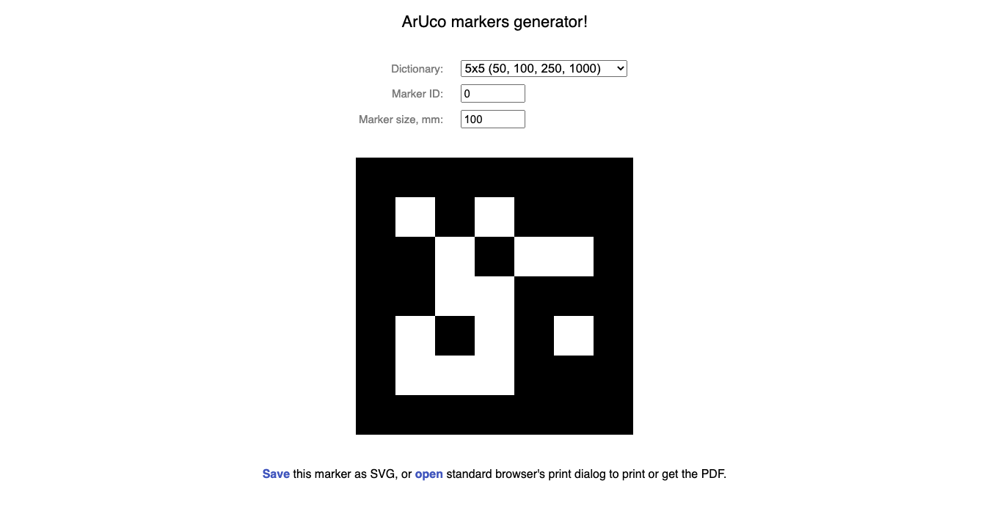

# Software voor video mapping
## Waarom?

Uit het gebruikersonderzoek is gebleken dat kinderen, die het operatiekwartier binnen komen, eerst naar de kasten en lege muren kijken. Vervolgens moeten ze dan op het bed op hun rug gaan liggen, waardoor ze de kasten niet meer zien en enkel zicht hebben op het plafond.
Logischerwijs trokken we de conclusie dat het beeld zowel op de muren, als op het plafond geprojecteerd moest worden.  
De gemakkelijkste oplossing hier was natuurlijk om meerdere projectors in te schakelen, een voor het plafond, en een voor de muren. Maar dan moesten deze gefixeerd worden om de mapping juist te krijgen. En hadden we voor elke zaal waar dit gebruikt zou worden, meerdere projectoren nodig. Meerdere zalen omdat er telkens twee operatiekwartieren tot hun beschikking zijn, die afwisselend gebruikt worden (terwijl de andere gedesinfecteerd wordt). Dokters en verplegend personeel hebben echter niet de tijd om elke keer opnieuw een volledige setup te doen van de beelden, om de juiste mappings te doen of om projectors juist te richten. 

Door grote aruco markers tegen de kasten op te hangen (wij hadden de mogelijkheid deze door een plotter op stickerpapier te printen) konden we automatisch detecteren waar de opstelling op moest projecteren, welk vlak wat was en hoe dit geörienteerd moest zijn. Op deze manier was het dan ook mogelijk selectief te programmeren, en bijvoorbeeld werkruimten met rust te laten, zodat dokters hun werk konden doen.

## software setup

Het originele beeldmateriaal werd geproduceerd in Unity (zie [video creatie](./software_video_creation)). Je kan deze echter zelf ook produceren en deze toevoegen aan de applicatie.

Ga door volgende stappen om eigen beelden toe te voegen:

1. Produceer 3 videolagen voor zowel plafond als muur (zij aanzicht en boven aanzicht)
    1. Een achtergrond
    1. Een voorgrond (inclusief transparantie)
    1. Een interactielaag (inclusief transparantie)
1. Doe dit voor beide thema's (in ons geval onderwater en ruimtereis)
1. Maak in de `bin/data` folder een map aan genaamd `/space`, en een map genaamd `/water`
1. copieer de videofiles naar de overeenkomstige mappen
1. controleer de naamgeving via de  **video settings en oppervlakten** subtitel
1. build en run de applicatie

### Prerequisites 

* Een reeds geïnstalleerde versie van [Openframeworks](https://openframeworks.cc/download/), beschikbaar op zowel OSX, windows als op linux.
* TouchOSC, geïnstalleerd op GSM
* [TouchOSC Bridge](https://hexler.net/products/touchosc)
* [TouchOSC editor](https://hexler.net/products/touchosc)

windows: gebruik [VSCode](https://openframeworks.cc/setup/vs/)
mac: Gebruik [XCode](https://openframeworks.cc/setup/xcode/)
Linux: Gebruik [whatever](https://openframeworks.cc/setup/linux-install/)

### Openframeworks

Openframeworks is een open source C++ based framework, supercharged met addons. 

Openframeworks is een framework ontwikkeld door Zach Lieberman als een toolbox voor creative coding (oa dus voor interactieve video installaties zoals in dit project). Het is sindsdien opgenomen door de open source crowd en kent nog steeds uitbreidingen en updates. We kozen voor openframeworks omdat de detectie van Aruco markers (gezien onze deadline) het snelst implementeerbaar was door het gebruik van bestaande openframeworks addons. Daarbij waren de addons voor OSC en interface design meteen ook van waarde.

Om het project te kunnen builden hebben we nood aan onderstaande plugins. Sommigen zijn reeds in openframeworks aanwezig, anderen moeten aan deze folder toegevoegd worden. Je kan dit doen door deze  manueel te downloaden en toe te voegen aan de `addons` folder in openframeworks.

* [ofxAruco](https://github.com/arturoc/ofxAruco)
* [ofxCv](https://github.com/kylemcdonald/ofxCv)
* ofxGui - (included)
* [ofxHapPlayer](https://github.com/bangnoise/ofxHapPlayer)
* ofxOpenCv - (included)
* ofxOsc - (included)
* ofxPoco - (included)
* ofxXmlSettings - (included)

#### Install OpenFrameWorks

volg de installatieguides op [openframeworks](https://openframeworks.cc/download/)

#### From git to build

Het builden van het project verschilt van OS tot OS, hieronder een korte oplijsting:

*Ik begon initieel met development op macOS, daar dit mijn standaard platform is. We stapten over op windows eens we tot de conclusie kwamen dat de RPI3 niet performant genoeg was, en de RPI4 openframeworks nog niet ondersteunde. We hadden tevens ook de tijd niet dit extenstief te testen en de applicatie te optimaliseren. We kochten een NUC aan en zorgden dat de applicatie hierop kon werken. dit onder andere door de toevoeging van de hap video player, ter ondersteuning van video op windows.*

##### Mac

!!! ofxHapPlayer is niet beschikbaar voor mac, deze kan vervangen worden door ofVideoPlayer, maar dan moeten bepaalde lijnen (getError) verwijderd worden. Daarnaast mag je ook niet vergeten deze uit de addons.make file te halen.

* Download en extract deze repository via zipfile of download via git 
* Kopieer `arucoMap` naar  `openframeworks/apps/myApps`
* Gebruik de [projectGenerator](https://openframeworks.cc/learning/01_basics/create_a_new_project/) om het project aan te maken
    * Open de projectGenerator
    * Klik import en navigeer naar de project folder
    * Druk op "generate" om de project files aan te maken, dit maakt tevens ook de xcode project files aan

* Open het project in xcode
* gebruik de build functionaliteiten om de applicatie te builden en te runnen

Je kan dit ook builden en runnen met "make" en "make run", daarvoor neem je volgende stappen:

* Dupliceer de emptyproject folder en geef deze een nieuwe naam
* kopieer de `/src` en `/bin` folder naar de nieuw aangemaakte folder
* kopieer (en vervang dus) de `addons.make` file door deze uit het gedownloade project
* in een terminal, navigeer naar deze folder, en run volgend command: `make && make run`

in de src folder komen de projectfiles, in de bin folder zitten zowel de data files (video en XML files) als de uiteindelijk builds. 

##### windows

* Download en extract deze repository via zipfile of download via git 
* Kopieer `arucoMap` naar  `openframeworks/apps/myApps`
* kopieer de emptyproject folder
* kopieer de `/src` en `/bin` folder naar de nieuw aangemaakte folder
* Open het project in VSCode
* gebruik de build functionaliteiten om de applicatie te builden en te runnen

##### Linux
* Download en extract deze repository via zipfile of download via git 
* Kopieer `arucoMap` naar  `openframeworks/apps/myApps`
* kopieer de emptyproject folder
* kopieer de `/src` en `/bin` folder naar de nieuw aangemaakte folder
* kopieer (en vervang dus) de `addons.make` file door deze uit het gedownloadde project
* in een terminal, navigeer naar deze folder, en run volgend command: `make && make run`

Na het builden van het project kan u de applicatie opstarten. Deze geeft echter initieel een zwart scherm. Dit is omdat de applicatie draait in "Live" modus, en nog geen markers kan detecteren. Markers worden namelijk enkel gedetecteerd indien de tracking modus aan staat. dit gebeurt terwijl de knop "T" of "6" ingehouden wordt. Indien er slechts 1 marker gedetecteerd word, kan je hiervan het te projecteren vlak instellen via OSC (zie hfst OSC). Dit moet natuurlijk initieel gebeuren om de eerste projectievlakken aan te maken. 

## Openframeworks libraries

### remote control

#### OSC

Om de projectie-opstelling aan te kunnen sturen, kunnen we werken in twee modi. We spreken over de 'live' modus (met markers) en de 'preset' modus (zonder markers). 

Je kan dit aanpassen via de remote numpad (0 zijnde live, 1 tot 3 zijnde presets). 

##### preset modus
De presets tonen een vooringestelde configuratie van projectievlakken. Om deze vlakken, of die van de presets in te stellen maken we gebruik van OSC. OSC is een communicatiemethode die te vergelijken valt met MIDI, waar deze kan communiceren met anderen OSC enabled devices via channels.

TouchOSC werd gebruikt om deze vlakken in te stellen. De file die hiervoor nodig is, bevindt zich in de "additions" folder.

Ik gebruikte [touchOSC](https://hexler.net/products/touchosc), een (helaas betalende) app waarmee je messages en slider waarden (zie foto voor interface) kan doorsturen naar de applicatie via het IP adress van de computer indien je met hetzelfde netwerk geconnecteerd bent

##### live modus

De live modus staat toe de camera te gebruiken om markers te detecteren en op basis hiervan vlakken te projecteren.

Indien de applicatie is ingesteld op "live", en er slechts één marker zichtbaar is, kan je hiervan de view instellen via TouchOSC. Vergeet niet het juiste IP adres in te stellen in `settings.hpp`.

##### Live 

| Name | Function |
| ------------- |:-------------:|
| Scale | Schaal van het projectievlak |
| **Output** | **Projectievlak instellingen** |
| X | Horizontale positie | 
| Y | Verticale positie  |
| Z | Diepte positie |
| Width | Breedte van het vlak |
| Height | Hoogte van het vlak |
| **Video** | **Video input instellingen** |
| X | Horizontale positie | 
| Y | Verticale positie  |
| Width | Breedte van de crop |
| Height | Hoogte van de crop |
| Ceiling | Gebruik de ceiling video ipv de wall video | 
| Write | Instellingen oplaan |

##### Presets

❗️❗️❗️ "Edit mode" moet ingeschakeld staan om wijzigingen te kunnen aanbrengen. (tweede scherm onderaan) ❗️❗️❗️

| Screen 1 | Screen 2 | Screen 3 |
| :-------------: |:-------------:| :-------------:|
|  |  |  |

| Name | Function |
| ------------- |:-------------:|
| Previous preset | Vorige preset |
| Next preset | Volgende preset |
| Delete preset | Verwijder huidige preset |
| **Video** | **Video input instellingen** |
| X | Horizontale positie | 
| Y | Verticale positie  |
| Width | Breedte van de crop |
| Height | Hoogte van de crop |
| **Positionering** | **Positie instellingen** |
| Width | Breedte van de preset |
| Height | Hoogte van de preset |
| X | Horizontale positie | 
| Y | Verticale positie  |
| Z | Diepte positie  |
| RX | Horizontale rotatie | 
| RY | Verticale rotatie  |
| RZ | Diepte rotatie  |

### projection mapping - Markers

#### Aruco

Aruco markers worden gebruikt om de applicatie te vertellen op welke vlakken (de muren, het plafond, ...)  deze behoort te projecteren. De markers die wij gebruikten zijn ten minste A3 formaat om zeker te zijn dat de webcam deze accurraat kan detecteren. Hoe groter deze zijn, hoe beter de resultaten. Eens de applicatie opstart, en de gebruiker de tracking activeert, worden de markers gezocht door de `ArucoHandler.cpp` class. Dit is het moment waarop het belangrijk is de projector en de webcam juist te aligneren. 

Elke aruco marker kent een uniek ID, die gebruikt kan worden om een bepaald deel van een video te projecteren, met een bepaalde transformatie (width, height, x- and y-offset). 

#### markers 

De markers zijn belangrijk voor de Aruco library. Indien deze gedetecteerd worden door de library kan deze afleiden welke marker het is en in welke orientatie deze zich bevindt. Door deze orientatie dan toe te passen op de beelden komt de automatische mapping tot stand. 

Het is dan ook belangrijk dat de markers groot genoeg zijn (in ons geval minstens A3), en niet op reflecterend papier afgeprint worden (don't make our mistakes). 

Markers kunnen gegenereerd worden met bijvoorbeeld [een online tool](https://chev.me/arucogen/), het is echter aangeraden de ID van de gegenereerde marker reeds toe te voegen aan de `bin/data/presets.xml` file.

## video settings en oppervlakten

De video input kent drie video lagen voor de muren, en drie voor het plafond, allen geëncodeerd in [HAP](https://hap.video/) (om transparantie te ondersteunen).

De eerste laag is de achtergrond, de opeenvolgenden worden hierover gelegd:

* `[water or space]/[wall or ceiling]_background.mov`
* `[water or space]/[wall or ceiling]_foreground.mov`
* `[water or space]/[wall or ceiling]_interaction.mov`

 Dit kan welliswaar worden aangepast in de code om slechts 1 video te gebruiken, al zou dit ervoor zorgen dat het interactiegedeelte niet meer werkt.

Een [FBO](https://openframeworks.cc/documentation/gl/ofFbo/) wordt eerst opgebouwt in de update functie dewelke de drie videolagen opeen legt en zo een FBO shader genereerd. Deze kan nadien in de draw functie getekend worden met de transformatie gedetecteerd door de aruco class.
Dit gebeurt door de transformatie, die de aruco class herkent, aan te vullen met informatie ingegeven door de OSC class. 

Het hospitaal maakt gebruik van een mascotte, genaamd groene Louis. We probeerden deze terug te laten komen in de installatie, om de kinderen een vertrouwd beeld te geven in een onzeker moment. Groene Louis springt in beeld vanuit één zijde door gebruik te maken van shortcut "4" of "L". Hierdoor konden de dokters dit aanroepen wanneer ze deze nodig hadden.

## Video projection - Presets

De presets kunnen gebruikt worden in locaties waar de markers niet opgehangen kunnen worden of niet aanwezig zijn. Dit bijvoorbeeld in een dokterskwartier of dergelijke. De presets geven een voor-ingestelde opstelling weer van vlakken. De eerste hiervan kan gebruikt worden op de kruising tussen twee muren en het plafond. De tweede is een vast projectievlak (recht tegenover).

Om deze presets in te stellen, zie OSC.

## Shortcuts

We gebruikten een draadloze numpad om binnen een steriele omgeving de applicatie te kunnen gebruiken. 

| Function | Key |
| ------------- |:-------------:|
| Track markers | 6 / T |
| Display live | 0 | 
| Display Preset 1 | 1 |
| Display Preset 2 | 2 |
| Display Preset 3 | 3 |
| Display overlay interaction | 4 / L |
| Display in-video interaction | 5 / I |
| Debug mode* | 7 / V |
| Show webcam image | 8 / C |
| Mute sound | 9 |
| Load space scene | - / S |
| Load water scene | + / W |
| Play sound | . |

* Debug mode: Weergave van de indicatie rond gevonden aruco markers

## Known issues

Er zijn een paar problemen waar we weet van hebben, maar waar we ten tijde van filmen niet de tijd voor hadden om deze op te lossen

### Mapping Z-offset

1. De locatie van de projecties op basis van de markers kent een probleem waarbij de Z offset slecht ingesteld staat. Dit heeft invloed op de multiplier van de grootte van de projecties. 
2. Het netwerken via OSC had anders gekund, bijvoorbeeld door een lokaal netwerk, of kleine included router.
